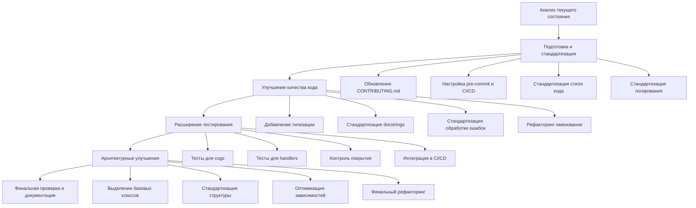

# Подробный план унификации проекта PD Bot

## 1. Анализ текущего состояния

### 1.1. Положительные аспекты
- **Документация**: README.md очень подробный и хорошо структурированный, содержит всю необходимую информацию о проекте.
- **Структура проекта**: Четкое разделение на cogs, utils, handlers, tests.
- **Инструменты качества кода**: Настроены black, isort, flake8, mypy, pre-commit.
- **Тестирование**: Хорошее покрытие тестами для utils.
- **Логирование**: Определена иерархическая структура логгеров.
- **CONTRIBUTING.md**: Содержит основные правила контрибьюции.
- **UNIFICATION_PLAN.md**: Уже существует план унификации, который можно использовать как основу.

### 1.2. Проблемные аспекты
- **Неравномерное качество кода**: Некоторые модули (например, music) хорошо структурированы и документированы, другие могут быть менее качественными.
- **Отсутствие единого стиля docstrings**: Хотя в CONTRIBUTING.md указан Google style, не все файлы могут ему следовать.
- **Неполное покрытие тестами**: Тесты есть только для utils, но не для cogs и handlers.
- **Отсутствие CI/CD**: Нет автоматизации проверок при пуш-запросах.
- **Смешение языков в комментариях**: Некоторые комментарии могут быть на английском, хотя требуется русский.
- **Возможная несогласованность в именовании**: Переменные, функции и классы могут иметь разные стили именования.
- **Разный уровень использования типизации**: Не все файлы могут иметь полную типизацию.

## 2. План унификации

### 2.1. Стандартизация кода

#### 2.1.1. Стиль кода
- **Задача**: Обеспечить единый стиль кода во всех файлах.
- **Действия**:
  - Проверить все файлы на соответствие PEP8 с помощью flake8.
  - Применить black ко всем файлам для унификации форматирования.
  - Применить isort для стандартизации импортов.
  - Создать скрипт для автоматического применения этих инструментов ко всем файлам.

#### 2.1.2. Типизация
- **Задача**: Обеспечить полную типизацию во всех файлах.
- **Действия**:
  - Проверить все файлы на наличие аннотаций типов с помощью mypy.
  - Добавить аннотации типов во все публичные функции и методы.
  - Использовать typing_extensions для сложных типов.
  - Добавить проверку типов в CI/CD.

#### 2.1.3. Документация кода
- **Задача**: Обеспечить единый стиль документации во всех файлах.
- **Действия**:
  - Стандартизировать docstrings в Google style на русском языке.
  - Добавить docstrings ко всем публичным классам, методам и функциям.
  - Проверить соответствие docstrings реальной функциональности.
  - Добавить примеры использования в docstrings для сложных функций.

#### 2.1.4. Именование
- **Задача**: Обеспечить единый стиль именования во всех файлах.
- **Действия**:
  - Стандартизировать именование переменных, функций, классов и модулей.
  - Использовать snake_case для переменных и функций.
  - Использовать CamelCase для классов.
  - Использовать UPPER_CASE для констант.
  - Обеспечить осмысленные имена на русском языке в комментариях и документации.

### 2.2. Архитектурная унификация

#### 2.2.1. Структура модулей
- **Задача**: Обеспечить единую структуру модулей.
- **Действия**:
  - Стандартизировать структуру всех cogs по образцу лучших (например, music.py).
  - Выделить общие паттерны в базовые классы.
  - Обеспечить единый подход к обработке ошибок.
  - Стандартизировать структуру utils по образцу лучших (например, music/player.py).

#### 2.2.2. Логирование
- **Задача**: Обеспечить единый подход к логированию во всех файлах.
- **Действия**:
  - Проверить все файлы на использование правильной иерархии логгеров.
  - Заменить все print на вызовы логгера.
  - Стандартизировать уровни логирования (info, debug, warning, error).
  - Обеспечить информативные сообщения логов на русском языке.

#### 2.2.3. Обработка ошибок
- **Задача**: Обеспечить единый подход к обработке ошибок.
- **Действия**:
  - Использовать декоратор @command_error_handler для всех команд.
  - Стандартизировать сообщения об ошибках.
  - Обеспечить корректное логирование ошибок.
  - Создать единый механизм обработки исключений.

### 2.3. Тестирование

#### 2.3.1. Расширение покрытия тестами
- **Задача**: Обеспечить полное покрытие тестами.
- **Действия**:
  - Добавить тесты для всех cogs.
  - Добавить тесты для всех handlers.
  - Обеспечить покрытие тестами всех публичных функций и методов.
  - Использовать pytest-cov для контроля покрытия.

#### 2.3.2. Стандартизация тестов
- **Задача**: Обеспечить единый подход к тестированию.
- **Действия**:
  - Стандартизировать структуру тестов по образцу лучших (например, test_music_player.py).
  - Использовать фикстуры для общих объектов.
  - Использовать параметризацию для тестирования разных входных данных.
  - Обеспечить изоляцию тестов с помощью mock/monkeypatch.

### 2.4. Автоматизация и CI/CD

#### 2.4.1. Настройка pre-commit
- **Задача**: Обеспечить автоматическую проверку кода перед коммитом.
- **Действия**:
  - Настроить pre-commit для запуска flake8, black, isort, mypy.
  - Добавить проверку docstrings.
  - Добавить проверку на отсутствие print.
  - Добавить проверку на отсутствие TODO.

#### 2.4.2. Настройка CI/CD
- **Задача**: Обеспечить автоматическую проверку кода при пуш-запросах.
- **Действия**:
  - Настроить GitHub Actions для запуска тестов.
  - Добавить проверку стиля кода.
  - Добавить проверку типизации.
  - Добавить проверку покрытия тестами.

### 2.5. Документация

#### 2.5.1. Обновление README.md
- **Задача**: Обеспечить актуальность README.md.
- **Действия**:
  - Обновить информацию о проекте.
  - Добавить информацию о новых стандартах.
  - Добавить информацию о CI/CD.
  - Обновить инструкции по установке и запуску.

#### 2.5.2. Обновление CONTRIBUTING.md
- **Задача**: Обеспечить актуальность CONTRIBUTING.md.
- **Действия**:
  - Добавить подробные инструкции по стилю кода.
  - Добавить инструкции по типизации.
  - Добавить инструкции по документации.
  - Добавить инструкции по тестированию.

#### 2.5.3. Создание STYLE_GUIDE.md
- **Задача**: Создать подробное руководство по стилю кода.
- **Действия**:
  - Описать стандарты форматирования.
  - Описать стандарты именования.
  - Описать стандарты документации.
  - Описать стандарты типизации.

## 3. Приоритеты и этапы реализации

### 3.1. Этап 1: Подготовка и стандартизация
1. Обновление CONTRIBUTING.md и создание STYLE_GUIDE.md.
2. Настройка pre-commit и CI/CD.
3. Стандартизация стиля кода (black, isort, flake8).
4. Стандартизация логирования.

### 3.2. Этап 2: Улучшение качества кода
1. Добавление типизации.
2. Стандартизация docstrings.
3. Стандартизация обработки ошибок.
4. Рефакторинг именования.

### 3.3. Этап 3: Расширение тестирования
1. Добавление тестов для cogs.
2. Добавление тестов для handlers.
3. Настройка контроля покрытия.
4. Интеграция тестов в CI/CD.

### 3.4. Этап 4: Архитектурные улучшения
1. Выделение общих паттернов в базовые классы.
2. Стандартизация структуры модулей.
3. Оптимизация зависимостей.
4. Финальный рефакторинг.

## 4. Диаграмма процесса унификации

## 5. Оценка существующих документов

### 5.1. README.md
- **Положительные аспекты**: Очень подробный, хорошо структурированный, содержит всю необходимую информацию.
- **Что можно улучшить**:
  - Добавить информацию о CI/CD.
  - Обновить информацию о стандартах кода.
  - Добавить раздел о контрибьюции с ссылкой на CONTRIBUTING.md.
  - Добавить раздел о стиле кода с ссылкой на STYLE_GUIDE.md.

### 5.2. CONTRIBUTING.md
- **Положительные аспекты**: Содержит основные правила контрибьюции, четко структурирован.
- **Что можно улучшить**:
  - Добавить более подробные инструкции по стилю кода.
  - Добавить примеры правильного и неправильного кода.
  - Добавить инструкции по типизации.
  - Расширить раздел о тестировании.

### 5.3. UNIFICATION_PLAN.md
- **Положительные аспекты**: Содержит хороший план унификации, четко структурирован.
- **Что можно улучшить**:
  - Добавить конкретные примеры для каждого пункта.
  - Добавить сроки выполнения.
  - Добавить ответственных за каждый пункт.
  - Добавить метрики успеха для каждого пункта.

## 6. Конкретные рекомендации по файлам

### 6.1. Примеры хорошего кода (эталоны)
- **utils/music/player.py**: Хорошо структурирован, имеет полную типизацию, хорошие docstrings, правильное логирование.
- **cogs/music.py**: Хорошо структурирован, имеет полную типизацию, хорошие docstrings, правильное логирование.
- **tests/test_utils/test_music_player.py**: Хорошо структурирован, имеет хорошее покрытие, использует фикстуры и моки.

### 6.2. Файлы, требующие улучшения
- Необходимо проверить все остальные файлы на соответствие стандартам эталонных файлов.
- Особое внимание уделить файлам, которые не имеют полной типизации, docstrings или правильного логирования.

## 7. Заключение

Проект PD Bot имеет хорошую основу для унификации. Существующие документы (README.md, CONTRIBUTING.md, UNIFICATION_PLAN.md) содержат много полезной информации, которую можно использовать как основу для дальнейшей работы. Некоторые файлы (например, utils/music/player.py, cogs/music.py) могут служить эталонами для остальных файлов.

Основные направления работы:
1. Стандартизация стиля кода, типизации, docstrings и логирования.
2. Расширение покрытия тестами.
3. Настройка автоматизации и CI/CD.
4. Обновление документации.

Реализация этого плана позволит привести весь код проекта и всю логику к полному единообразию, что сделает проект более цельным и легким в поддержке.
