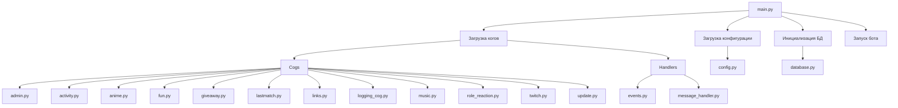
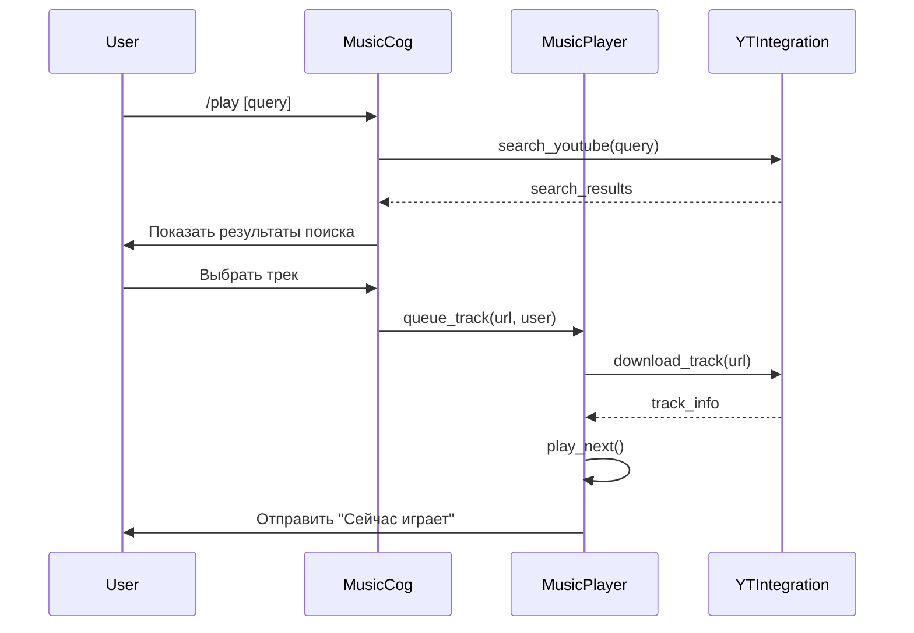
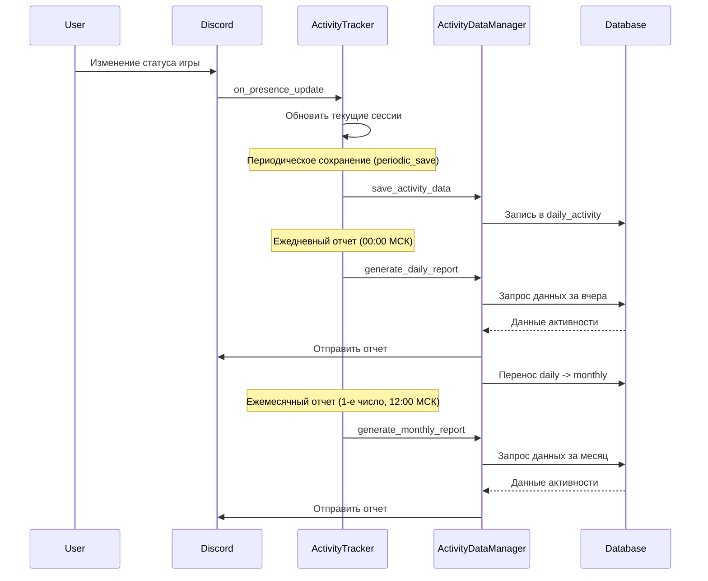
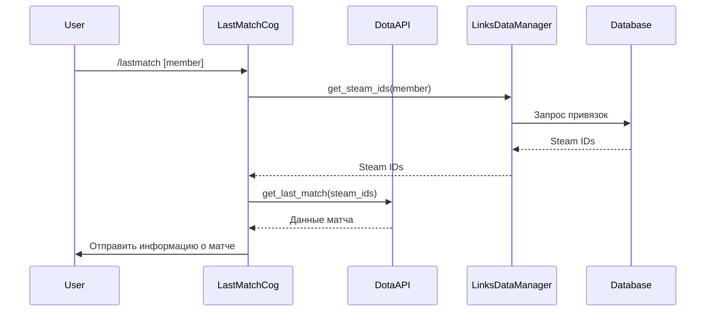
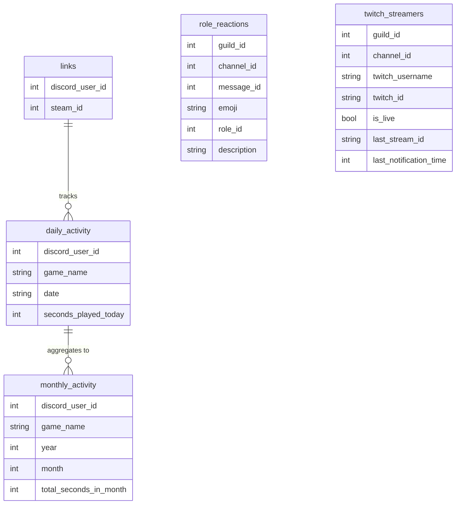
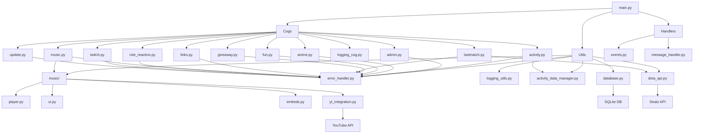

# Архитектура PD Bot

## Общая структура проекта



## Поток данных в музыкальном модуле



## Поток данных в модуле отслеживания активности



## Поток данных в модуле Dota 2



## Структура базы данных



## Взаимодействие компонентов системы



## Жизненный цикл команды

```mermaid
sequenceDiagram
    participant User
    participant Discord
    participant Bot
    participant CommandHandler
    participant Cog
    participant ErrorHandler

    User->>Discord: Отправка команды
    Discord->>Bot: on_message / on_interaction
    Bot->>CommandHandler: Парсинг и поиск команды
    CommandHandler->>Cog: Вызов метода команды

    alt Успешное выполнение
        Cog->>User: Ответ на команду
    else Ошибка
        Cog->>ErrorHandler: Перехват исключения
        ErrorHandler->>User: Сообщение об ошибке
    end
