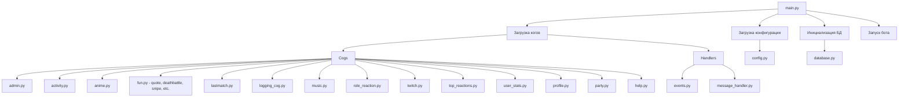
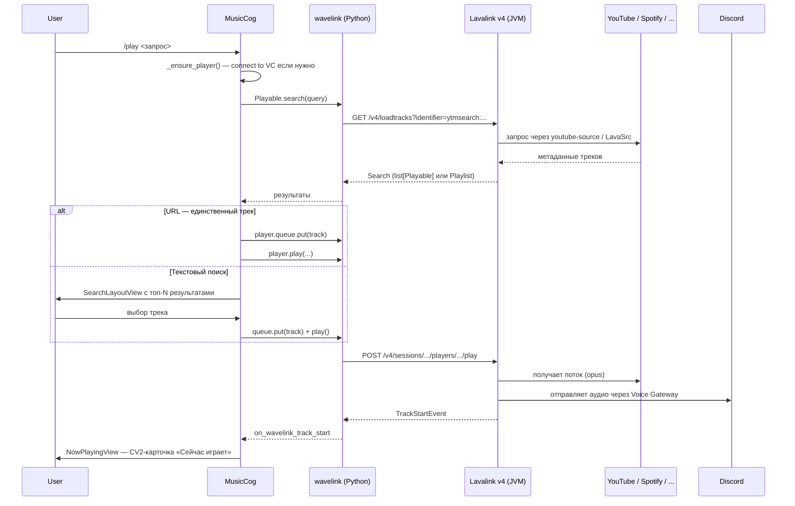
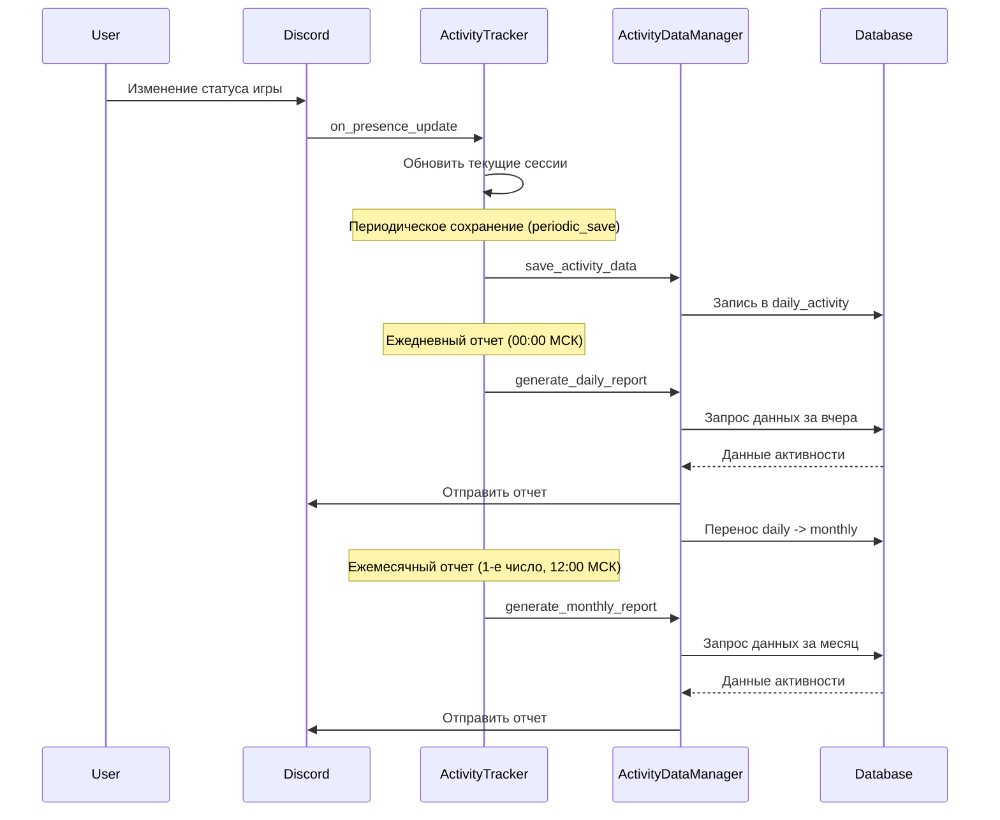
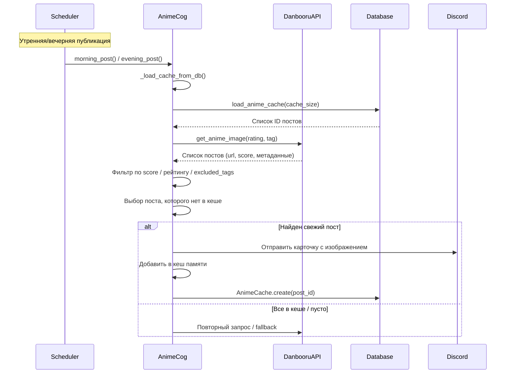
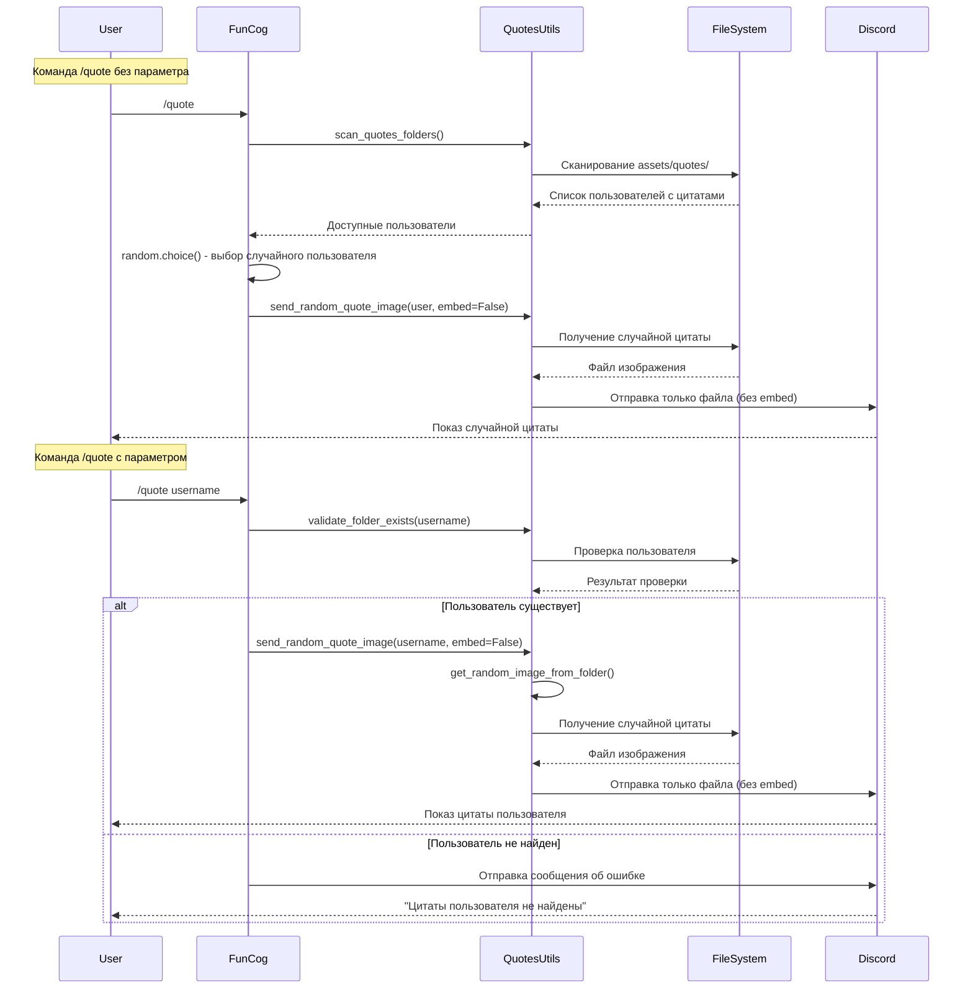
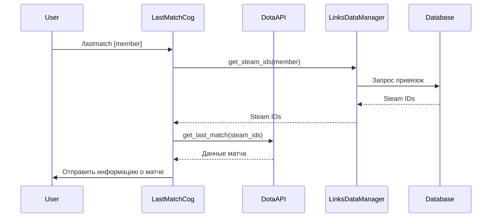
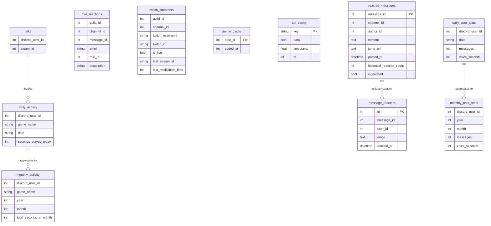
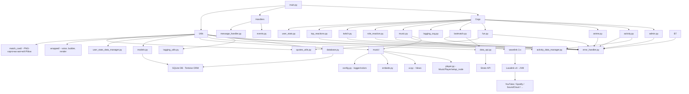
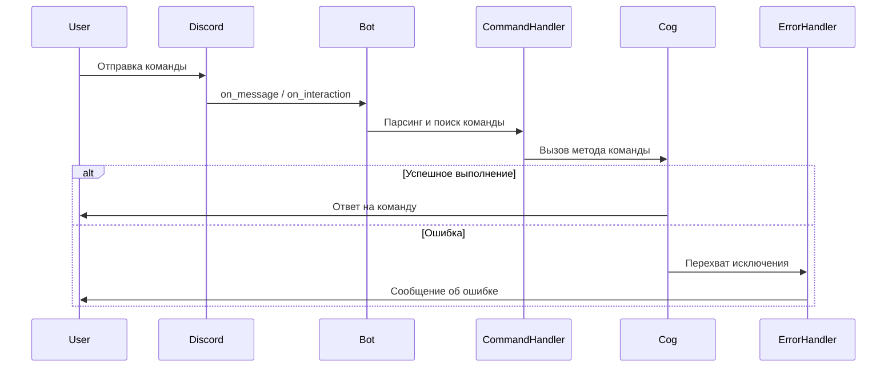
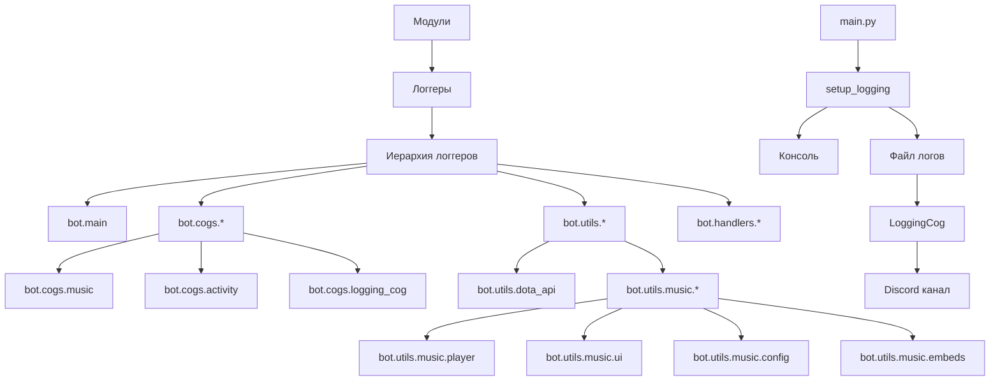

# Архитектура PD Bot

## Общая структура проекта

### Жизненный цикл запуска

`main()` инициализирует БД и загружает коги/хендлеры **до** `bot.start()`, поэтому
к моменту `MyBot.setup_hook` дерево app-команд уже заполнено. Синхронизация
slash-команд (и контекст-меню) делается один раз за процесс именно в
`setup_hook` — это канон discord.py и заменяет прежний ручной флаг в
`Events.on_ready` (тот срабатывал на каждый reconnect). `on_ready` теперь только
логирует готовность и ставит presence. Persistent-вью регистрируются в `cog_load`
своих когов.

Контекст-меню (ПКМ) живут внутри когов: создаются как `app_commands.ContextMenu`
в `__init__` и добавляются в `bot.tree`, снимаются в `cog_unload`. Активно одно —
«Профиль» (по юзеру, `cogs/profile.py`). «В цитаты» (по сообщению,
`cogs/fun.py`) заморожено: колбэк/хелпер есть, но в дерево не регистрируются —
ждём доработки до «скриншот-цитаты».

`/help` не хранит отдельный список команд: `HelpCog` читает актуальный
`CommandTree` и группирует slash-команды вместе с контекстными действиями по
подсистемам. Это не даёт справке расходиться с реально синхронизированным деревом.

### Завершение процесса

`main()` устанавливает обработчики `SIGINT` и `SIGTERM`. Они отменяют основную
задачу и переводят процесс в общий `finally`: Discord-клиент получает до 3 секунд,
HTTP/Lavalink-клиенты закрываются параллельно с лимитом 2 секунды каждый, после
чего БД закрывается отдельным шагом с лимитом 2 секунды. Зависание одного сетевого
ресурса поэтому не мешает закрыть остальные ресурсы и SQLite.

## Поток данных в музыкальном модуле

Музыка работает поверх **Lavalink v4** (отдельный JVM-контейнер) и Python-клиента **wavelink 3.x**. Бот ничего не транскодирует сам — он лишь отправляет команды Lavalink-ноде и слушает её события.

Ключевые компоненты:

- `cogs/music.py` — все hybrid-команды + слушатели событий wavelink.
- `utils/music/player.py::MusicPlayer` — subclass `wavelink.Player`; добавляет `text_channel`, `now_playing_message` и привязку «трек → заказчик» через `track.extras.requester_id`.
- `utils/music/ui.py` — Components V2-представления `NowPlayingView`, `SearchLayoutView` и `QueueLayoutView`: контент и интерактив живут в одном `LayoutView` (контейнер + `Section`/`Thumbnail` + `ActionRow`-кнопки). Для `/nowplaying` используется статический `now_playing_static_view`.
- `utils/music/embeds.py` — общие форматтеры и CV2-карточки `status_card`, `added_to_queue_card`, `added_playlist_card`.
- `lavalink/application.yml` — конфиг JVM-сервиса с плагинами `youtube-source` и `LavaSrc`.

Выбор трека и кнопки паузы, пропуска и остановки подтверждают interaction через
`defer()` до сетевого вызова Lavalink. После выполнения действия карточка
обновляется через `edit_original_response()`, чтобы задержка ноды не приводила
к просроченному первому ответу Discord.

## Поток данных в модуле отслеживания активности

Завершённые интервалы игровых сессий хранятся отдельно от текущих сессий в
`ActivityTracker._pending_activity`, с разбивкой по московским датам. Выход из
игры или смена игры сразу закрывает старую сессию в памяти. При ошибке БД
следующее сохранение повторяет запись фиксированного числа секунд, даже если
активных сессий уже нет. Успешно записанные даты удаляются из очереди отдельно,
поэтому частичный сбой на границе суток не удваивает уже сохранённое время.
Очередь находится в памяти процесса и не переживает аварийный перезапуск.

## Поток данных в аниме-модуле

Ручная и плановая публикация используют общий `asyncio.Lock` на весь цикл
выбора, отправки и обновления кеша. Следующая публикация выбирает изображение
с учётом результата предыдущей. Если Discord отклонил отправку, изображение
не попадает в кеш и остаётся доступным для повторной попытки.

## Поток данных в модуле Quote

## Привязки в профиле

`cogs/profile.py` открывает публичный `/profile` и личный профиль через ПКМ,
владеет `ProfileAccountService`. Публичные вкладки могут переключать все участники;
управление привязками разрешено только владельцу и использует личные диалоги.
`utils/profile/account_views.py` отвечает за форму с одним полем, предпросмотр,
выбор аккаунта и подтверждение отвязки. На каждом этапе проверяются владелец
и срок действия исходной панели. HTTP-сессия Steam закрывается при выгрузке кога.

`utils/profile/accounts.py` разбирает только известные форматы Steam, Dota и FACEIT.
Числовые Steam ID преобразуются локально, именные ссылки разрешаются через
`ResolveVanityURL` с необязательным `STEAM_API_KEY`; FACEIT использует существующий API-клиент.
Имена Dota кэшируются в `APICache`; открытие вкладки не вызывает внешние API.

`ProfileAccountsDataManager` записывает в существующие `links` и `cs_links`.
Проверки лимита, дубликата и добавление выполняются в транзакции под блокировкой
пользователя, общей для всех панелей процесса. Для отвязки обязательно задаются
владелец и конкретный аккаунт. Модели и схема базы не меняются.

## Объявления об обновлениях

`cogs/announcements.py` запускает доставку после `on_ready` только в production.
Повторный `on_ready` не создаёт вторую задачу. Текст и стабильный ID релиза берутся
из `config/release_notes.yaml`, а канал — из `channels.announcements`.
Пустой текст отключает публикацию; новая ревизия образа сама по себе анонс не создаёт.

`utils/release_announcements.py` сохраняет журнал всех объявленных ID в
`data/release_announcements.json` на существующем Docker volume. Перед отправкой
атомарно записывается намерение, после отправки — ID сообщения. Если подтверждение
потерялось, бот ищет собственную CV2-карточку с подписью релиза в истории канала
после начала попытки. Ошибка чтения истории или повреждённый журнал запрещают
повторную отправку вслепую. Повторы после ошибок выполняются раз в пять минут.
Сохранённые ID предотвращают повтор при откате на уже объявленный релиз.
Схема SQLite не меняется. Новых команд или persistent-кнопок у объявления нет.

## Поток данных в модуле Dota 2

## Структура базы данных

Таблицы `daily_user_stats` / `monthly_user_stats` ведёт `cogs/user_stats.py`
(сообщения + «умное» голосовое время), а `wrapped/`-подсистема собирает из них,
из игровой активности и из реакций красивые wrapped-сводки (matplotlib).

## Взаимодействие компонентов системы

## Жизненный цикл команды

## Система логирования

### Особенности системы логирования

- **Иерархическая структура**: Все логгеры следуют единой иерархии, начиная с `bot`
- **JSON-форматирование**: Логи сохраняются в JSON-формате для удобного анализа
- **Цветной вывод в консоль**: Разные уровни логирования отображаются разными цветами
- **Пересылка в Discord**: Логи автоматически пересылаются в указанный Discord-канал
- **Граница запуска**: Каждый новый процесс начинает Discord-tail отдельным заголовком
  со временем и окружением; `WARNING`/`ERROR`/`CRITICAL` получают заметный префикс
- **Без рекурсивного шума**: Служебные `INFO`/`DEBUG` самого `LoggingCog` не идут
  обратно в Discord, но полностью сохраняются в файловом JSON-логе
- **Контекстное логирование**: Возможность добавления контекста к группе логов
