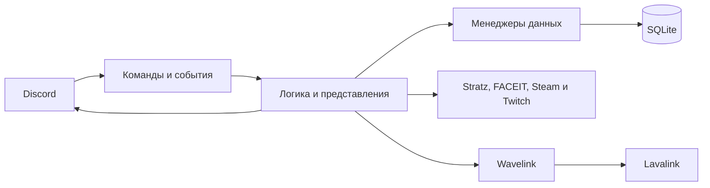

# Архитектура

PD Bot — один процесс Python для одного Discord-сервера примерно на 30–40 человек.
Расширение на несколько серверов не предусмотрено. Логика разделена на коги и
небольшие модули, постоянные данные хранятся в SQLite. Для музыки используется
отдельный Lavalink; остальные интеграции вызываются по HTTP.

## Карта проекта

| Путь | Ответственность |
| --- | --- |
| `main.py` | Инициализация, загрузка расширений, синхронизация команд, завершение процесса |
| `config/` | Pydantic-модели, YAML-настройки и текст объявления релиза |
| `cogs/` | Команды Discord, обработчики событий и фоновые задачи функций бота |
| `handlers/` | Общие события подключения, сообщений и голосовых каналов |
| `utils/*_data_manager.py`, `utils/party/data_manager.py` | Чтение и изменение постоянных данных |
| `utils/models.py`, `utils/database.py` | Модели Tortoise ORM и подключение SQLite |
| `utils/profile/`, `utils/activity/`, `utils/wrapped/` | Профили, отчёты и карточки итогов |
| `utils/music/`, `utils/party/`, `utils/tyan/` | Музыкальный плеер, сборы участников и дневная тянка |
| `utils/dota_api.py`, `utils/cs_api.py`, `utils/twitch_api.py` | Клиенты внешних API |
| `utils/match_card/`, `utils/ui/` | Рендер матчей, общие компоненты интерфейса и палитра |
| `tests/` | Тесты, повторяющие структуру исходников |
| `ops/` | Отдельные административные операции: резервная копия БД и сброс дневной тянки |
| `docs/` | Документация MkDocs |

`data/`, `logs/` и другие рабочие каталоги содержат состояние конкретного
экземпляра. Они не являются частью исходного кода.

## Основные потоки

- **Профиль и матчи.** `/profile` объединяет статистику и игровые аккаунты.
  Привязка проходит через разбор ссылки или ID, проверку внешнего аккаунта и
  подтверждение владельца. Команды матчей берут сохранённые привязки, запрашивают
  Stratz или FACEIT и собирают PNG-карточку. Карточка Dota загружает изображения
  параллельно, не более четырёх за раз.
- **Статистика.** События присутствия фиксируют игровое время, голосовые события —
  длительность общения, обработчик сообщений — счётчики сообщений. Периодические
  задачи сохраняют накопленное время. Дневные данные переходят в месячные агрегаты;
  профили, отчёты и wrapped используют эти данные повторно.
- **Реакции.** События реакций наполняют таблицы сообщений и участников, поставивших
  реакции. Лидерборды и моменты профиля перед публикацией ограничивают выборку
  общедоступными каналами через `utils/channel_permissions.py`.
- **Музыка.** Команда передаёт запрос в Wavelink и Lavalink. Собственный
  `MusicPlayer` хранит очередь и связь с сообщением плеера; события Lavalink
  обновляют состояние и интерфейс.
- **Сборы.** `/party` создаёт публичную карточку и приглашения в личных сообщениях.
  Менеджер пати ведёт участников, проверку готовности и абсолютный дедлайн.
  Доступ и задержка между сборами проверяются также при публикации превью.
- **Автопосты.** Anime использует расписание и историю отправленных постов;
  Twitch опрашивает состояние трансляций. Объявления релизов читают
  `config/release_notes.yaml` и собственный журнал доставки.

## Данные и время

| Хранилище | Что сохраняется |
| --- | --- |
| SQLite: `links`, `cs_links` | Привязки игровых аккаунтов |
| SQLite: `daily_activity`, `monthly_activity` | Игровое время по пользователям и играм |
| SQLite: `daily_user_stats`, `monthly_user_stats` | Счётчики сообщений и голосовое время |
| SQLite: `reacted_messages`, `message_reactors` | Данные для топа реакций и моментов |
| SQLite: `role_reactions`, `twitch_streamers`, `party_blocks` | Настройки ролей, подписки Twitch и ограничения сборов |
| SQLite: `tyan_rolls` | Дневные результаты тянки |
| SQLite: `api_cache`, `anime_cache` | Кэш API и история аниме-постов |
| `data/release_announcements.json` | Журнал доставки объявлений между перезапусками |
| Каталог цитат и `logs/` | Сохранённые изображения цитат и журналы работы |

SQLite работает через Tortoise ORM с WAL и ожиданием кратковременной блокировки.
Перенос дневных агрегатов выполняется транзакционно. Создание отсутствующих таблиц
при старте не заменяет миграцию существующей схемы: изменение моделей требует
отдельного плана переноса данных и резервной копии.

Продолжительности считаются по UTC, границы календарного дня — по `Europe/Moscow`
из `utils/time_utils.py`. Интервал через полночь разделяется между датами.
Для полей времени в SQLite сохранён существующий формат UTC без суффикса часового
пояса (`use_tz=False`); произвольная смена этого формата нарушит текущие запросы.

Активные игровые и голосовые сессии, очередь повторов при ошибке записи, текущие
сборы, состояние плеера и snipe-кэш находятся в памяти процесса. Корректная остановка
пытается сохранить накопленную статистику и закрыть сборы, но аварийное завершение
не гарантирует сохранение ещё не записанных интервалов. Восстановление активной
пати после рестарта не реализовано.

## Асинхронная работа

Общий цикл событий обслуживает Discord, сетевые запросы и фоновые задачи.
Блокировки защищают операции над общей сессией, привязками и состоянием пати.
Игровое и голосовое время ставится в очередь как завершённый интервал: повтор
записи не должен продолжать начисление после выхода пользователя.

HTTP-клиенты переиспользуют сессии. Stratz и FACEIT кэшируют ответы и объединяют
одинаковые одновременные запросы; повторы учитывают ограничение частоты API.
Кэш изображений ограничен 256 адресами и 32 MiB, отдельная загрузка — 8 MiB;
неудачная загрузка не блокирует следующую попытку. Рендер PNG и крупные файловые
операции выносятся в `asyncio.to_thread`, чтобы не задерживать обработку Discord.

## Запуск и остановка

1. Загружаются настройки и логирование. `main()` открывает SQLite и удаляет
   просроченные записи кэша API.
2. `load_cogs()` загружает файлы `cogs/` с функцией `setup(bot)`, затем два
   расширения из `handlers/`.
3. До подключения к Gateway `setup_hook()` синхронизирует команды. При заданном
   `GUILD_ID` используется дерево единственного сервера.
4. Обработчики `on_ready` и `before_loop` выполняют подготовку после подключения.
   Повторный `on_ready` при переподключении не должен создавать вторые таймеры.
   Постоянные кнопки ролей регистрируются в `cog_load()`.
5. При остановке сначала закрывается Discord-клиент: коги отменяют задачи,
   сохраняют статистику и закрывают принадлежащие им ресурсы. Затем закрываются
   общие HTTP-клиенты и Lavalink, последней — БД. Этапы завершения ограничены
   по времени; ошибка одного ресурса не отменяет закрытие остальных.

Порядок установки и запуска описан в [начале работы](getting-started.md),
поставка контейнера — в [развёртывании](deployment.md), изменения кода —
в [руководстве разработчика](style-guide.md).
