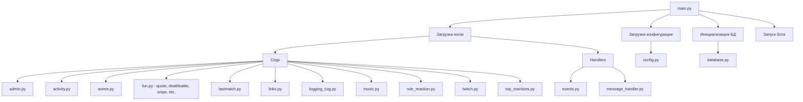
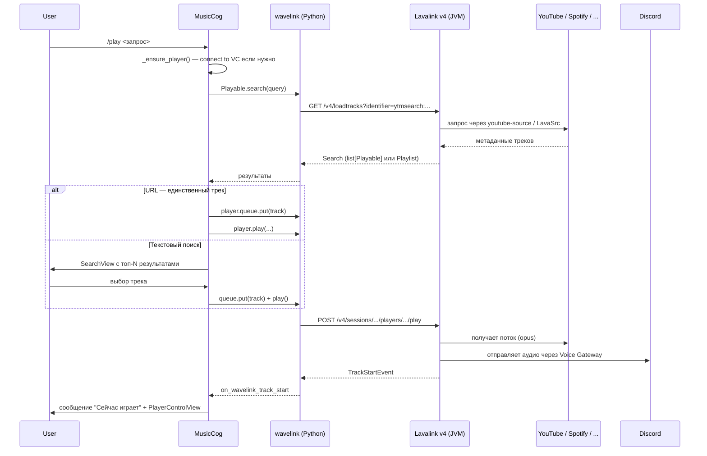
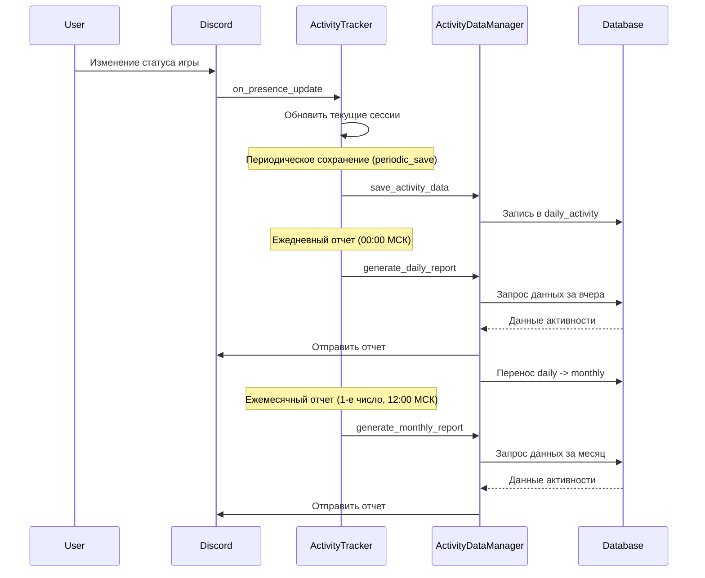
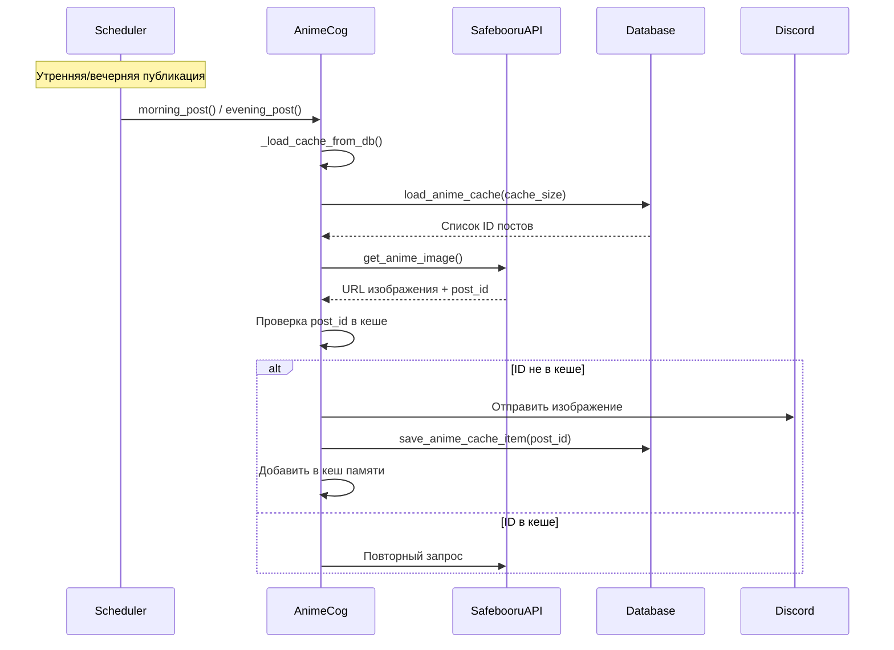
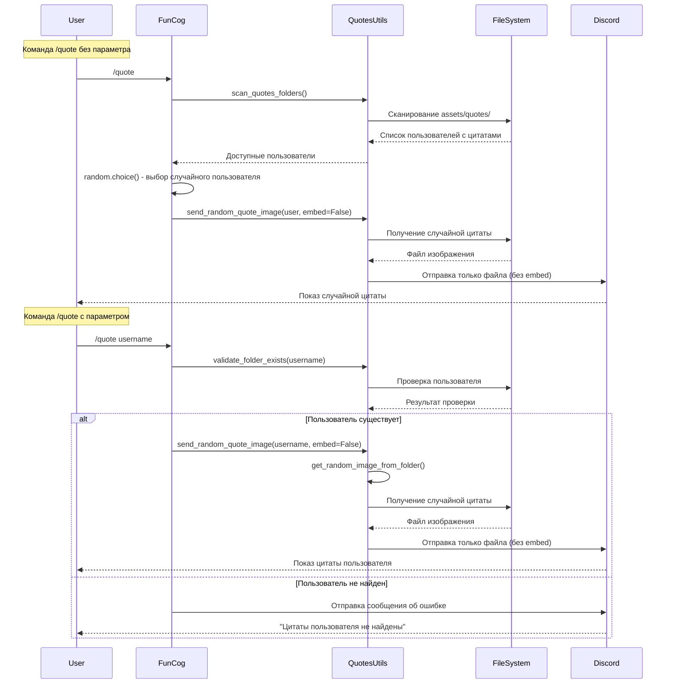
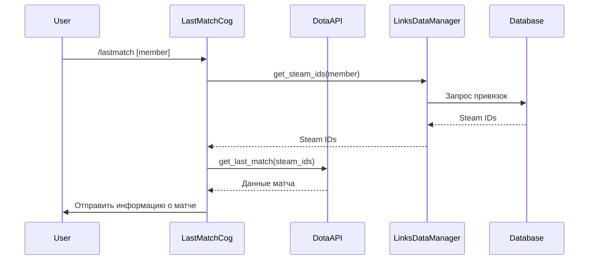
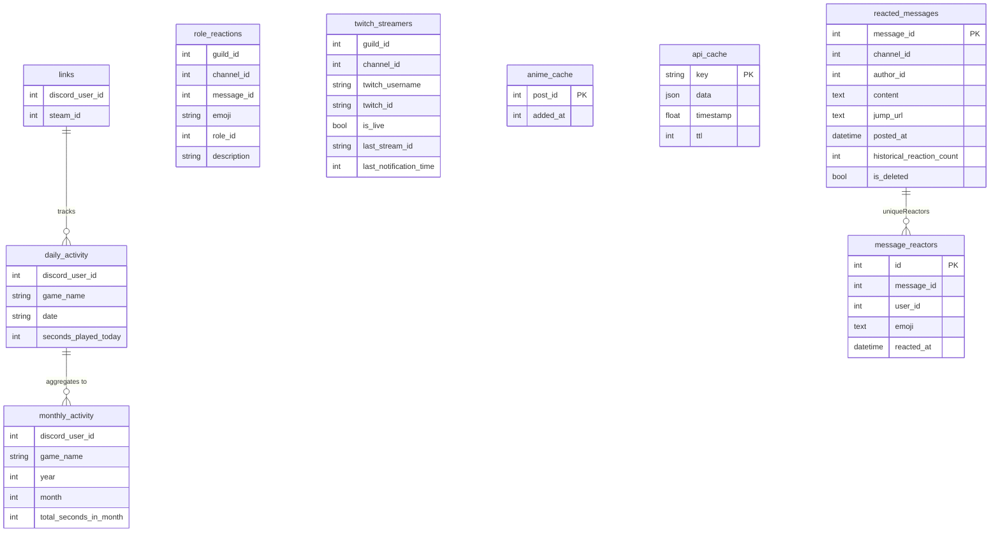
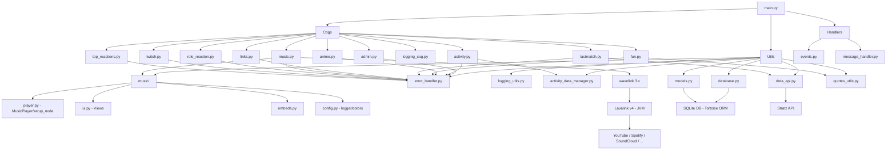
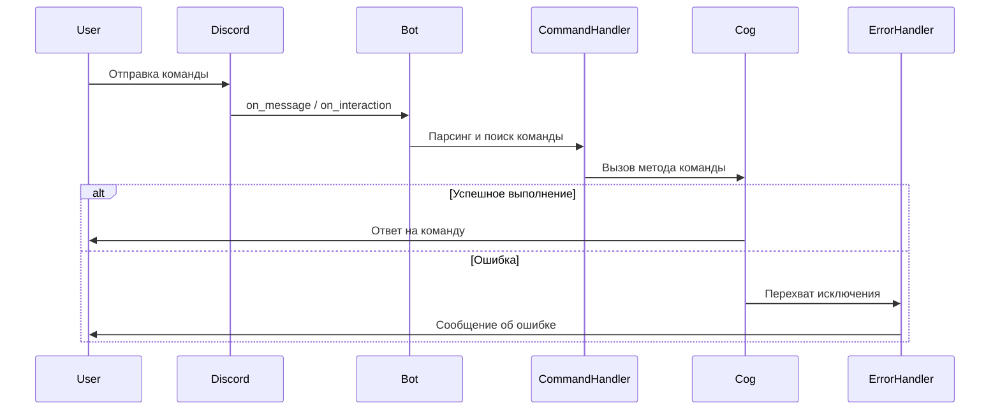
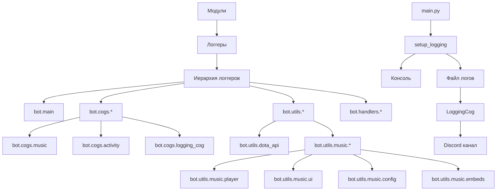

# Архитектура PD Bot

## Общая структура проекта

## Поток данных в музыкальном модуле

Музыка работает поверх **Lavalink v4** (отдельный JVM-контейнер) и Python-клиента **wavelink 3.x**. Бот ничего не транскодирует сам — он лишь отправляет команды Lavalink-ноде и слушает её события.

Ключевые компоненты:

- `cogs/music.py` — все hybrid-команды + слушатели событий wavelink.
- `utils/music/player.py::MusicPlayer` — subclass `wavelink.Player`; добавляет `text_channel`, `now_playing_message` и привязку «трек → заказчик» через `track.extras.requester_id`.
- `utils/music/ui.py` — три View: `PlayerControlView` (кнопки под now-playing), `SearchView` (Select), `QueueView` (пагинация).
- `utils/music/embeds.py` — единый стиль эмбедов: now-playing, added-to-queue, queue, playlist.
- `lavalink/application.yml` — конфиг JVM-сервиса с плагинами `youtube-source` и `LavaSrc`.

## Поток данных в модуле отслеживания активности

## Поток данных в аниме-модуле

## Поток данных в модуле Quote

## Поток данных в модуле Dota 2

## Структура базы данных

## Взаимодействие компонентов системы

## Жизненный цикл команды

## Система логирования

### Особенности системы логирования

- **Иерархическая структура**: Все логгеры следуют единой иерархии, начиная с `bot`
- **JSON-форматирование**: Логи сохраняются в JSON-формате для удобного анализа
- **Цветной вывод в консоль**: Разные уровни логирования отображаются разными цветами
- **Пересылка в Discord**: Логи автоматически пересылаются в указанный Discord-канал
- **Контекстное логирование**: Возможность добавления контекста к группе логов
