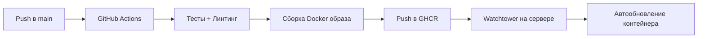

# Деплой

## Архитектура CI/CD



## GitHub Actions

При пуше в ветку `main` автоматически:

1. Запускаются тесты и линтинг (ruff)
2. Собирается Docker-образ
3. Образ публикуется в GitHub Container Registry (`ghcr.io/twinlab/pd_bot:latest`)

Конфигурация: `.github/workflows/deploy.yml`

## Настройка сервера

### 1. Подготовка

Отредактируйте `docker-compose.yml`:

- Раскомментируйте `image: ghcr.io/...`
- Закомментируйте `build: .`

### 2. Запуск

```bash
docker compose up -d
```

Watchtower автоматически проверяет наличие новых образов и обновляет бота.

### 3. Данные

Данные сохраняются через Docker volumes:

- SQLite база данных (`data/bot_data.db`)
- Логи (`logs/`)
- Ресурсы (`assets/`)

## Локальная разработка с Docker

```bash
# Использовать build: . в docker-compose.yml
docker compose up -d --build
```

## Обновление

Обновление происходит автоматически при пуше в `main` (CI/CD + Watchtower).
