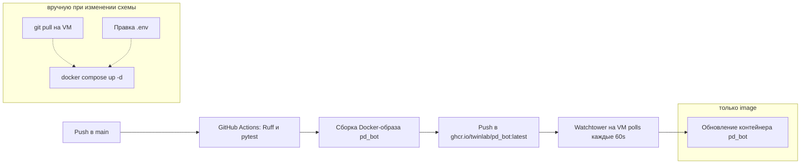

# Деплой

## TL;DR — что произойдёт при мердже в `main`

> ⚠️ **Важно: одного мерджа в `main` недостаточно при структурных изменениях.** Watchtower на VM обновляет только `image` существующих контейнеров — он **не** пуллит `docker-compose.yml` из git, **не** добавляет новые сервисы и **не** создаёт новые env-переменные. Если в PR появился новый сервис, env или volume — после мерджа нужно зайти на VM и выполнить `git pull && docker compose up -d` руками.

Что произойдёт автоматически:

1. CI прогонит Ruff и pytest, соберёт новый `ghcr.io/twinlab/pd_bot:latest` и запушит в GHCR.
2. Watchtower на VM через ≤60 секунд увидит новый image, остановит старый контейнер `pd_bot`, поднимет новый из того же `image`, с теми же volume/env/network что были на VM **до** этого момента.
3. Новый бот загрузится и фоном подключится к существующему сервису `lavalink:2333`.
4. При временной недоступности Lavalink остальные подсистемы продолжат работать, а музыкальные команды будут возвращать контролируемую ошибку до восстановления ноды.

При остановке контейнера бот обрабатывает `SIGTERM`: закрытие Discord ограничено
3 секундами, сетевые клиенты — 2 секундами параллельно, SQLite — отдельными
2 секундами. Даже при зависшем клиенте штатное завершение занимает не более
примерно 7 секунд и укладывается в стандартное окно остановки Docker.

---

## Архитектура CI/CD



GitHub Actions конфигурация: `.github/workflows/deploy.yml`. На VM достаточно одного `docker compose up -d`, чтобы запустить связку `bot + lavalink + yt-cipher + watchtower`. Watchtower автоматически обновляет бот с тегом `:latest` и `yt-cipher:master`; остальные инфраструктурные образы закреплены по версии и digest.

### Что Watchtower умеет и **не** умеет

| Умеет | Не умеет |
|-------|----------|
| Подтягивать новые `:latest` image-ы из GHCR | Подтягивать новый `docker-compose.yml` из git |
| Перезапускать контейнеры с label `com.centurylinklabs.watchtower.enable=true` | Создавать **новые** сервисы, появившиеся в compose-файле |
| Удалять старые image-ы (`--cleanup`) | Менять `env_file`, `environment`, `volumes`, `depends_on`, `networks` существующего сервиса |
| Авторизоваться в GHCR через `REPO_USER`/`REPO_PASS` | Читать ваши новые секреты из репозитория |

Поэтому любое **структурное** изменение docker-compose (новый сервис, новые env, новые volume) требует ручного шага на VM.

Отдельная gotcha: `lavalink/application.yml` — это volume-mount, поэтому после правок нужен `docker compose restart lavalink` руками (Watchtower не среагирует — образ не меняется).

### Обновление инфраструктуры и музыкальных плагинов

Python, Lavalink и Watchtower закреплены по версии и OCI digest. Плагины `youtube-source`
и LavaSrc закреплены Maven-координатами в `lavalink/application.yml`. Они тоже требуют
регулярного обновления, но обновляются отдельным PR вместе с проверкой совместимости
конфига, версии Lavalink и воспроизведения.

`yt-cipher` — исключение: сервис отслеживает частые изменения `player.js`, поэтому
использует `master` и автоматически обновляется Watchtower.

Для закреплённых компонентов:

1. Выбрать совместимую версию и прочитать release notes.
2. Проверить manifest командой `docker buildx imagetools inspect <image>`.
3. Обновить тег и digest в `Dockerfile` или `docker-compose.yml`.
4. Прогнать тесты и Docker build.
5. После мерджа выполнить на VM `git pull && docker compose up -d`.

`LAVALINK_SERVER_PASSWORD` обязателен. Compose завершит проверку конфигурации ошибкой, если переменная отсутствует; известного fallback-пароля нет.

---

## Сервис `yt-cipher`

Stateless-сервис [kikkia/yt-cipher](https://github.com/kikkia/yt-cipher) — выносит signature-decoding (`/s/player/<hash>/...`) из плагина `youtube-source` в отдельный контейнер, потому что YouTube часто меняет обфускацию player.js и плагин за ней не успевает. Подключение — `plugins.youtube.remoteCipher` в `lavalink/application.yml`.

В compose должна использоваться переменная `OVERRIDE_PLAYER_VARIANT=IAS`.
Старое имя `OVERRIDE_SCRIPT_VARIANT` актуальный образ `yt-cipher` не читает.

Адрес сервиса можно переопределить без правки YAML:

```dotenv
YOUTUBE_REMOTE_CIPHER_URL=https://cipher.kikkia.dev/
```

По умолчанию используется локальный `http://yt-cipher:8001`. Публичный endpoint
имеет ограничение 10 запросов/с и не гарантирует стопроцентную доступность, поэтому
он нужен прежде всего как fallback или для конфигурации с внешним HTTP-прокси.

---

## Прокси для Lavalink

`PROXY_URL` загружается Python-конфигом бота, но Lavalink и `youtube-source` эту
переменную не разбирают. Для JVM-контейнера нужны штатные Spring Boot переменные:

```dotenv
LAVALINK_SERVER_HTTP_CONFIG_PROXY_HOST=proxy.example.com
LAVALINK_SERVER_HTTP_CONFIG_PROXY_PORT=3128
LAVALINK_SERVER_HTTP_CONFIG_PROXY_USER=username
LAVALINK_SERVER_HTTP_CONFIG_PROXY_PASSWORD=password
```

Указывать нужно HTTP/HTTPS CONNECT-прокси: host без `http://`, порт отдельно.
Если авторизации нет, переменные `USER` и `PASSWORD` следует полностью удалить,
а не оставлять пустыми.

`httpConfig` применяется ко всем запросам HTTP-клиента YouTube-плагина, включая
обращение к `remoteCipher`. Внешний прокси обычно не может разрешить внутреннее
Docker-имя `yt-cipher`. В таком случае есть два варианта:

1. Подключить прокси-контейнер к сети `pd_bot_net`, чтобы он видел `yt-cipher`.
2. Задать `YOUTUBE_REMOTE_CIPHER_URL=https://cipher.kikkia.dev/`, чтобы cipher-запрос
   тоже шёл через прокси на публично разрешимое имя.

Не добавляйте значения прокси в `application.yml`: логин и пароль должны оставаться
только в `.env` на VM.

---

## Диагностика музыки на VM

Проверки ниже не печатают значения секретов.

### 1. Состояние контейнеров и доступность cipher

```bash
docker compose ps
docker compose exec lavalink sh -lc 'nc -z yt-cipher 8001 && echo "yt-cipher: reachable"'
```

Если используется публичный `YOUTUBE_REMOTE_CIPHER_URL`, второй тест проверяет только
локальный сервис и не является обязательным.

### 2. Наличие OAuth и прокси в окружении Lavalink

```bash
docker compose exec lavalink sh -lc \
  'test -n "$YOUTUBE_REFRESH_TOKEN" && echo "oauth=set" || echo "oauth=missing";
   test -n "$LAVALINK_SERVER_HTTP_CONFIG_PROXY_HOST" && echo "proxy_host=set" || echo "proxy_host=missing";
   test -n "$LAVALINK_SERVER_HTTP_CONFIG_PROXY_PORT" && echo "proxy_port=set" || echo "proxy_port=missing"'
```

`oauth=missing` допустим только на время первого device-flow. Для постоянной работы
нужен refresh token burner-аккаунта; основной Google-аккаунт использовать нельзя.

### 3. Версии загруженных плагинов

```bash
docker compose exec lavalink sh -lc \
  'wget -qO- --header="Authorization: $LAVALINK_SERVER_PASSWORD" \
  http://127.0.0.1:2333/v4/info'
```

В `plugins` должна быть версия `youtube-plugin` из `lavalink/application.yml`, а в
`sourceManagers` — `youtube`. Lavalink при старте сам удаляет старую версию jar из
persistent volume и скачивает объявленную.

### 4. Безопасный срез ошибок

```bash
docker compose logs --since=10m lavalink yt-cipher \
  | grep -E 'AllClientsFailed|RemoteCipher|read timeout|Sign in|403|429|youtube-plugin'

docker compose logs --since=10m bot \
  | grep -E 'VOICE_STATE_UPDATE|VOICE_SERVER_UPDATE|ChannelTimeout'
```

Не публикуйте целиком OAuth device-flow лог: в нём может появиться refresh token.

### Как читать результат

| Фрагмент ошибки | Что проверять |
|---|---|
| `Sign in to confirm you're not a bot`, `403`, `429` | OAuth, репутацию IP и фактическое наличие proxy-переменных |
| `RemoteCipher`, `resolve_url`, `read timeout` | Доступность `yt-cipher`, `YOUTUBE_REMOTE_CIPHER_URL`, таймауты |
| `AllClientsFailedException` | Вложенные причины по каждому InnerTube-клиенту; это исходная ошибка YouTube |
| В `/v4/info` нет `youtube` | Загрузку jar и версию `youtube-plugin` |
| `ChannelTimeoutException`, без `PATCH /players` в Lavalink | Порядок событий Discord Voice Gateway; `MusicPlayer` повторно собирает handshake после получения обеих частей |
| Трек стартует без YouTube-ошибок, но аудио нет | Discord Voice/DAVE и события voice gateway, а не источник YouTube |

После изменения `docker-compose.yml`, `application.yml` или `.env`:

```bash
git pull
docker compose pull bot yt-cipher
docker compose up -d --force-recreate yt-cipher lavalink bot
docker compose ps
```
