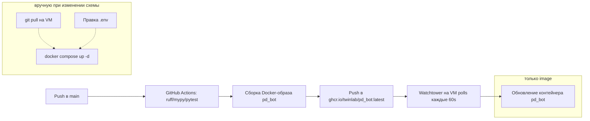

# Деплой

## TL;DR — что произойдёт при мердже в `main`

> ⚠️ **Важно: одного мерджа в `main` недостаточно при структурных изменениях.** Watchtower на VM обновляет только `image` существующих контейнеров — он **не** пуллит `docker-compose.yml` из git, **не** добавляет новые сервисы и **не** создаёт новые env-переменные. Если в PR появился новый сервис, env или volume — после мерджа нужно зайти на VM и выполнить `git pull && docker compose up -d` руками.

Что произойдёт автоматически:

1. CI прогонит ruff/mypy/pytest, соберёт новый `ghcr.io/twinlab/pd_bot:latest` и запушит в GHCR.
2. Watchtower на VM через ≤60 секунд увидит новый image, остановит старый контейнер `pd_bot`, поднимет новый из того же `image`, с теми же volume/env/network что были на VM **до** этого момента.
3. Новый бот загрузится. Музыкальный ког попытается **фоном** подключиться к `lavalink:2333` — ничего не найдёт (Lavalink-сервис на VM ещё не добавлен), залогирует ошибку и будет периодически переподключаться.
4. Все **не-музыкальные** команды (Dota, активность, аниме, twitch, реакции, фан) продолжат работать как обычно.
5. Любая музыкальная команда вернёт ошибку «Не удалось подключиться к голосовому каналу» или «Lavalink-нода не зарегистрирована».

То есть бот **не упадёт** и продолжит обслуживать всё кроме музыки. Чтобы оживить музыку — нужны шаги ниже.

---

## Архитектура CI/CD

GitHub Actions конфигурация: `.github/workflows/deploy.yml`. На VM достаточно одного `docker compose up -d`, чтобы запустить связку `bot + lavalink + watchtower`, дальше Watchtower обновляет image-ы.

### Что Watchtower умеет и **не** умеет

| Умеет | Не умеет |
|-------|----------|
| Подтягивать новые `:latest` image-ы из GHCR | Подтягивать новый `docker-compose.yml` из git |
| Перезапускать контейнеры с label `com.centurylinklabs.watchtower.enable=true` | Создавать **новые** сервисы, появившиеся в compose-файле |
| Удалять старые image-ы (`--cleanup`) | Менять `env_file`, `environment`, `volumes`, `depends_on`, `networks` существующего сервиса |
| Авторизоваться в GHCR через `REPO_USER`/`REPO_PASS` | Читать ваши новые секреты из репозитория |

Поэтому любое **структурное** изменение docker-compose (новый сервис, новые env, новые volume) требует ручного шага на VM.

Отдельная gotcha: `lavalink/application.yml` — это volume-mount, поэтому после правок нужен `docker compose restart lavalink` руками (Watchtower не среагирует — образ не меняется).

---

## Сервис `yt-cipher`

Stateless-сервис [kikkia/yt-cipher](https://github.com/kikkia/yt-cipher) — выносит signature-decoding (`/s/player/<hash>/...`) из плагина `youtube-source` в отдельный контейнер, потому что YouTube часто меняет обфускацию player.js и плагин за ней не успевает. Подключение — `plugins.youtube.remoteCipher` в `lavalink/application.yml`.
