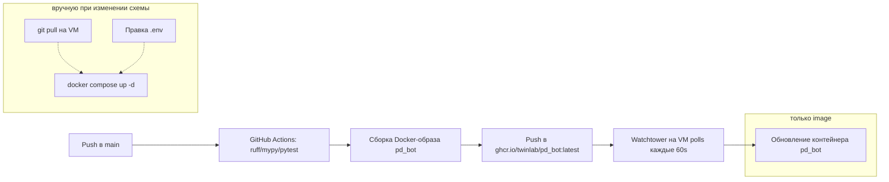

# Деплой

## TL;DR — что произойдёт при мердже в `main`

> ⚠️ **Важно: одного мерджа в `main` недостаточно.** Watchtower на VM обновляет только `image` существующих контейнеров — он **не** пуллит `docker-compose.yml` из git, **не** добавляет новые сервисы и **не** создаёт новые env-переменные. После мерджа на VM нужно сходить руками **один раз**, чтобы поднять контейнер Lavalink и прописать секреты. Подробная инструкция ниже в разделе [«Миграция с прежней схемы (yt-dlp → Lavalink)»](#миграция-с-прежней-схемы-yt-dlp-lavalink).

Что произойдёт автоматически:

1. CI прогонит ruff/mypy/pytest, соберёт новый `ghcr.io/twinlab/pd_bot:latest` и запушит в GHCR.
2. Watchtower на VM через ≤60 секунд увидит новый image, остановит старый контейнер `pd_bot`, поднимет новый из того же `image`, с теми же volume/env/network что были на VM **до** этого момента.
3. Новый бот загрузится. Музыкальный ког попытается **фоном** подключиться к `lavalink:2333` — ничего не найдёт (Lavalink-сервис на VM ещё не добавлен), залогирует ошибку и будет периодически переподключаться.
4. Все **не-музыкальные** команды (Dota, активность, аниме, twitch, реакции, фан) продолжат работать как обычно.
5. Любая музыкальная команда вернёт ошибку «Не удалось подключиться к голосовому каналу» или «Lavalink-нода не зарегистрирована».

То есть бот **не упадёт** и продолжит обслуживать всё кроме музыки. Чтобы оживить музыку — нужны шаги ниже.

---

## Архитектура CI/CD



GitHub Actions конфигурация: `.github/workflows/deploy.yml`. На VM достаточно одного `docker compose up -d`, чтобы запустить связку `bot + lavalink + watchtower`, дальше Watchtower обновляет image-ы.

### Что Watchtower умеет и **не** умеет

| Умеет | Не умеет |
|-------|----------|
| Подтягивать новые `:latest` image-ы из GHCR | Подтягивать новый `docker-compose.yml` из git |
| Перезапускать контейнеры с label `com.centurylinklabs.watchtower.enable=true` | Создавать **новые** сервисы, появившиеся в compose-файле |
| Удалять старые image-ы (`--cleanup`) | Менять `env_file`, `environment`, `volumes`, `depends_on`, `networks` существующего сервиса |
| Авторизоваться в GHCR через `REPO_USER`/`REPO_PASS` | Читать ваши новые секреты из репозитория |

Поэтому любое **структурное** изменение docker-compose (новый сервис, новые env, новые volume) требует ручного шага на VM.

---

## Миграция с прежней схемы (yt-dlp → Lavalink)

Один раз, после первого мерджа PR с Lavalink в `main`. Все команды — на VM, не локально.

### Шаг 0 — Где живёт код на VM

Обычно на VM есть git-checkout репозитория (например, `/root/pd_bot` или `/opt/pd_bot`) рядом с `docker-compose.yml`. Watchtower работает только с image-ами, но `docker compose up -d` всё равно читает `docker-compose.yml` из локальной директории. **Туда же должны попасть новые файлы из репозитория** (`lavalink/application.yml`, обновлённый `docker-compose.yml`, обновлённый `.env.example`).

Подключись по SSH:

```bash
ssh root@<твой-сервер>
cd /root/pd_bot   # или туда, где лежит твой checkout
```

### Шаг 1 — Подтянуть код из main

```bash
git status         # убедись что нет локальных правок, которые перетрутся
git pull origin main
```

После этого на VM должны появиться:

- Обновлённый `docker-compose.yml` (с сервисом `lavalink`).
- Новая директория `lavalink/` с `application.yml` и пустым `plugins/`.
- Обновлённый `.env.example` (но `.env` сам по себе **не обновится** — он гитнорится).
- Обновлённый `Dockerfile` (без ffmpeg).

### Шаг 2 — Добавить новые переменные в `.env`

Открой `.env` редактором (`nano .env` / `vim .env`) и добавь:

```env
# ============= Lavalink — обязательно =============
LAVALINK_HOST=lavalink
LAVALINK_PORT=2333
LAVALINK_SERVER_PASSWORD=<сгенерируй_рандом_см._ниже>

# ============= YouTube OAuth — оставь пока пустым =============
YOUTUBE_REFRESH_TOKEN=

# ============= Spotify — опционально =============
SPOTIFY_CLIENT_ID=
SPOTIFY_CLIENT_SECRET=
```

Сгенерировать случайный пароль для Lavalink:

```bash
openssl rand -hex 32
# скопируй вывод в LAVALINK_SERVER_PASSWORD
```

> 💡 Если в `.env` уже есть переменные с такими именами от старой схемы (а их не было — `BOT_TOKEN/STRATZ_API_KEY/TWITCH_*/PROXY_URL/REPO_*` остаются как были), они не пострадают.

### Шаг 3 — Дать права на директории Lavalink

Контейнер Lavalink запускается от непривилегированного пользователя `lavalink` (UID 322). Папки `./lavalink/plugins/` и `./lavalink/logs/` после `git pull` принадлежат тому, кто делал pull (обычно root). Если их не «подарить» контейнерному UID, Lavalink при первом запуске упадёт с `FileNotFoundException: ./plugins/youtube-plugin-1.18.1.jar (Permission denied)`.

```bash
sudo chown -R 322:322 lavalink/plugins lavalink/logs
```

Хост-юзера `322` не существует — это нормально, числовой UID работает напрямую. Эта операция нужна **один раз**; после `docker compose up -d` плагины и логи пишутся уже от правильного владельца.

### Шаг 4 — Подтянуть image Lavalink

```bash
docker compose pull lavalink
```

Это скачает `ghcr.io/lavalink-devs/lavalink:4-alpine` (~150 MB).

### Шаг 5 — Поднять связку

```bash
docker compose up -d
```

Что произойдёт:

1. Docker создаст новую сеть `pd_bot_net`.
2. Стартует сервис `lavalink`. При первом запуске он скачает плагины (`youtube-source` и `LavaSrc`) в `./lavalink/plugins/` (~20 MB, занимает 10–30 сек).
3. Healthcheck Lavalink через `wget http://localhost:2333/version` — после `start_period: 60s` он становится `healthy`.
4. Бот `pd_bot` ждёт, пока Lavalink не станет healthy (`depends_on: condition: service_healthy`), затем стартует и автоматически подключается к ноде.

Проверь, что оба сервиса в порядке:

```bash
docker compose ps
# должны быть: pd_bot (Up), pd_bot_lavalink (Up healthy), watchtower (Up)
docker compose logs --tail=50 lavalink
docker compose logs --tail=50 bot | grep -i lavalink
# в логах бота должно появиться:
# bot.music | Lavalink-нода MAIN готова (resumed=False, session_id=...)
```

### Шаг 6 — OAuth для YouTube

> 🔑 **Зачем:** YouTube активно блокирует анонимные запросы из дата-центров (Cloudflare-капчи, 403 «Sign in to confirm you're not a bot»). Авторизация через burner-аккаунт Google почти полностью эту проблему решает.
>
> ⚠️ **Только burner-аккаунт.** Заводи отдельный Google-аккаунт под бота. Google может пометить его как bot-account и заблокировать — терять реальный gmail из-за этого ты не захочешь.

#### 5.1 Найди device-flow код в логах Lavalink

```bash
docker compose logs --tail=100 lavalink | grep -iE 'oauth|device|youtube'
```

Должно быть что-то вроде:

```
[main] INFO  d.l.y.h.YoutubeOauth2Handler - To give youtube-source access to your account, go to
       https://www.google.com/device and enter the code XXXX-XXXX
```

Если этого нет — посмотри полные логи: `docker compose logs lavalink`. Возможно код прошёл выше при старте.

#### 5.2 Авторизуйся в браузере

1. Открой https://www.google.com/device.
2. Войди под **burner-аккаунтом** (не основным!).
3. Введи код из логов (`XXXX-XXXX`).
4. Подтверди разрешения для приложения `YouTube on TV` (это нормально — youtube-source использует device-flow от TV-клиента).

#### 5.3 Забери refresh-token из логов

После успешной авторизации Lavalink снова что-то напишет — следи за логами в реальном времени:

```bash
docker compose logs -f lavalink
```

Появится строка с `refresh_token`:

```
[..] INFO  d.l.y.h.YoutubeOauth2Handler - OAuth integration tokens received,
       refresh_token: 1//0g_<длинная-строка>
```

#### 5.4 Сохрани токен в `.env`

Скопируй значение `refresh_token` и положи в `.env`:

```env
YOUTUBE_REFRESH_TOKEN=1//0g_...твой_токен...
```

#### 5.5 Перезапусти Lavalink

```bash
docker compose restart lavalink
```

После рестарта Lavalink стартует уже с токеном — никакого device-flow больше не нужно. Refresh-token живёт годами; обновить его придётся только если Google его инвалидирует (увидишь 401 от YouTube в логах).

### Шаг 7 — Spotify (опционально)

Если **не** нужны spotify-ссылки — пропускай шаг, всё остальное работает (YouTube, SoundCloud, Bandcamp, Twitch, Vimeo).

Если нужны:

1. https://developer.spotify.com/dashboard → Create app (тип **Web API**). Redirect URI указать `http://localhost` (не используется).
2. Скопируй `Client ID` и `Client Secret`.
3. В `.env`:
   ```env
   SPOTIFY_CLIENT_ID=...
   SPOTIFY_CLIENT_SECRET=...
   ```
4. `docker compose restart lavalink`.

### Шаг 8 — Финальная проверка

В Discord (там, где работает бот):

```
/play https://www.youtube.com/watch?v=dQw4w9WgXcQ
```

Должно вернуть embed «✅ Добавлено в очередь» и заиграть. Дальше:

```
/queue
/nowplaying
/pause
/resume
/skip
/stop
```

Если что-то не работает — смотри [Диагностика](#диагностика) внизу. Часто всплывающие проблемы: [Permission denied на ./plugins/](#lavalink-падает-с-permission-denied-на-plugins) и [device-flow не появляется в логах](#бот-стартует-но-музыкальные-команды-не-работают).

---

## Архитектура сервисов

| Сервис | Образ | Что делает | Публичный порт |
|--------|-------|------------|---------------|
| `bot` | `ghcr.io/twinlab/pd_bot:latest` | Python-приложение бота, hybrid-команды, обработка ивентов | — |
| `lavalink` | `ghcr.io/lavalink-devs/lavalink:4-alpine` | JVM-сервер декодирования аудио, плагины YouTube/Spotify/... | — (только в docker-сети) |
| `watchtower` | `containrrr/watchtower` | Авто-обновление обоих контейнеров с GHCR | — |

Все три сервиса в одной сети `pd_bot_net` (bridge). Бот общается с Lavalink-ноды по `http://lavalink:2333` — это резолвится Docker-DNS. Порт `2333` наружу **не публикуется**: нода никому, кроме бота, не нужна.

### Lavalink

Lavalink v4 — standalone JVM-сервер. Бот выступает клиентом по WebSocket (через `wavelink 3.x`). Преимущества по сравнению с прежней схемой `yt-dlp + FFmpeg`:

- Один сервис обрабатывает любые источники одинаково — не надо тащить ffmpeg-subprocess внутри Python-процесса.
- YouTube bot-detection обходится через ротацию InnerTube-клиентов + OAuth.
- Меньше потребление CPU/RAM ботом (всё транскодирование — на стороне Lavalink, JVM-сборщик мусора).
- Стабильнее: WebSocket переподключается сам с экспоненциальным backoff-ом.

#### Подключённые плагины

`lavalink/application.yml` коммитится в репозиторий. Секреты подставляются через переменные окружения из `.env`:

- **[youtube-source 1.18.x](https://github.com/lavalink-devs/youtube-source)** — современный YouTube-источник вместо мёртвого встроенного. Использует ротацию клиентов (`MUSIC`, `TV`, `ANDROID_VR`, `WEB`, `WEBEMBEDDED`, `TVHTML5_SIMPLY`) и OAuth. В таблице клиентов youtube-source OAuth поддерживает **только клиент `TV`** — поэтому он явно включён в `application.yml` рядом с остальными. Без `TV` в списке плагин предупреждает «OAuth has been enabled without registering any OAuth-compatible clients» и анонимные запросы будут проходить мимо токена.
- **[LavaSrc 4.x](https://github.com/topi314/LavaSrc)** — Spotify / Apple Music / Deezer / Yandex Music: метаданные через API провайдера, стрим через YouTube.

При первом запуске Lavalink скачивает jar-плагины в смонтированный volume `./lavalink/plugins/` (закешированы между перезапусками; гитнорятся).

### Volumes

| Хост | Контейнер | Назначение |
|------|-----------|------------|
| `./data/` | `/app/data` (bot) | SQLite `bot_data.db` |
| `./logs/` | `/app/logs` (bot) | Логи Python-бота |
| `./assets/` | `/app/assets` (bot) | Quote-картинки и другие статические ассеты |
| `./lavalink/application.yml` | `/opt/Lavalink/application.yml:ro` | Конфиг Lavalink (read-only) |
| `./lavalink/plugins/` | `/opt/Lavalink/plugins` | Скачанные jar-плагины |
| `./lavalink/logs/` | `/opt/Lavalink/logs` | Логи Lavalink (rolling 100MB × 7 дней) |

### Watchtower

Обновляет оба контейнера с label `com.centurylinklabs.watchtower.enable=true` (это `bot` и `lavalink`). Аутентификация в GHCR через `REPO_USER`/`REPO_PASS` (PAT с правом `read:packages`). Сам `watchtower` себя не обновляет — для смены его версии нужно вручную `docker compose pull watchtower && docker compose up -d watchtower`.

---

## Альтернатива OAuth: PO Token

Если по каким-то причинам OAuth не работает (Google не даёт авторизоваться, аккаунт заблокирован прямо при device-flow), можно использовать **PO Token** (proof-of-origin). Это пара `poToken + visitorData`, которая получается через headless-браузер скриптом `iv-org/youtube-trusted-session-generator`.

Минусы:

- Токен живёт **~часами**, нужна периодическая регенерация (cron + сайдкар-контейнер).
- Покрывает только клиенты `WEB`/`WEBEMBEDDED`, не все.

Поэтому OAuth почти всегда предпочтительнее.

Если всё-таки нужен PO Token — раскомментируй секцию `plugins.youtube.pot` в `lavalink/application.yml` и добавь в `.env`:

```env
YOUTUBE_PO_TOKEN=...
YOUTUBE_VISITOR_DATA=...
```

---

## Локальная разработка

**Бот не запускается локально на машине разработчика.** Локально доступны только тесты, линт и тайпчек:

```bash
.venv/bin/pytest
.venv/bin/ruff check . && .venv/bin/ruff format --check .
.venv/bin/mypy .
```

Если очень нужно посмотреть, как контейнер собирается — раскомментируй `build: .` в `docker-compose.yml` и сделай `docker compose up -d --build`. Но это редко нужно — CI всё равно соберёт image при push в PR-ветку.

---

## Регулярное обновление

После первого ручного `docker compose up -d` с новой конфигурацией всё дальнейшее происходит автоматически:

1. Push в `main` → CI собирает новый `:latest` для `pd_bot`.
2. Watchtower на VM в течение ≤60 секунд видит новый image, перезапускает `pd_bot`.
3. Lavalink обновляется, когда выходит новая версия `ghcr.io/lavalink-devs/lavalink:4-alpine` — тот же Watchtower.

Принудительно обновиться можно так:

```bash
cd /root/pd_bot
docker compose pull
docker compose up -d
```

> 🚨 **Когда нужно снова идти на VM руками:**
>
> - Изменилась структура `docker-compose.yml` (новый сервис, новый volume, новый env-блок).
> - Добавились новые обязательные переменные в `.env.example`, которых нет в твоём `.env`.
> - Поменялся конфиг `lavalink/application.yml` (он монтируется с хоста, а не вшит в image).

В этих случаях после git pull нужен `docker compose up -d`. В остальных Watchtower всё делает сам.

---

## Диагностика

### Lavalink падает с `Permission denied` на `./plugins/`

В логах `docker compose logs lavalink` есть:

```
java.io.FileNotFoundException: ./plugins/youtube-plugin-1.18.1.jar (Permission denied)
```

Контейнер крутится в цикле рестартов и не доходит до открытия порта 2333 → бот в `waiting` ждёт healthcheck и не стартует. Причина: волюм `./lavalink/plugins` на хосте принадлежит root, а внутри контейнера юзер `lavalink` (UID 322) не может туда писать.

Лечится так:

```bash
sudo chown -R 322:322 lavalink/plugins lavalink/logs
docker compose restart lavalink
docker logs -f pd_bot_lavalink
```

Если по каким-то причинам `chown` нельзя — можно дать всем права на запись (менее безопасно, но рабоче):

```bash
sudo chmod -R 0777 lavalink/plugins lavalink/logs
docker compose restart lavalink
```

После этого Lavalink скачает плагины и в логах появится device-flow код (см. шаг 6 миграции).

### Бот стартует, но музыкальные команды не работают

Проверь, что Lavalink-нода поднялась и бот к ней подключился:

```bash
docker compose ps                           # lavalink должен быть "(healthy)"
docker compose logs --tail=100 lavalink     # без ошибок Spring/Java
docker compose logs --tail=100 bot | grep -i lavalink
# ожидаем: "Lavalink-нода MAIN готова"
```

Типичные причины:

- **Lavalink-сервис не запущен** — самая частая в первый раз. `docker compose up -d` создаст и запустит его, если он есть в `docker-compose.yml`.
- **`LAVALINK_SERVER_PASSWORD` в `.env` пустой или не совпадает** с тем, что внутри сервиса. Lavalink через Spring Boot читает env-переменную, и `application.yml` тоже её подставляет — главное, чтобы у бота и Lavalink значение было одинаковое.
- **Старая сеть** — если ты раньше уже запускал bot вне `pd_bot_net`, то `docker compose up -d` пересоздаёт сеть. Если сеть зависла — `docker compose down && docker compose up -d`.

### YouTube возвращает 403 / "Sign in to confirm you're not a bot"

```bash
docker compose logs --tail=200 lavalink | grep -iE 'youtube|oauth|403'
```

Причины:

- `YOUTUBE_REFRESH_TOKEN` пустой или устарел → перегенерируй (см. шаг 5 миграции).
- Burner-аккаунт заблокирован Google → заведи новый, прогрей пару дней, повтори device-flow.
- Все клиенты выпали из ротации → проверь `plugins.youtube.clients` в `lavalink/application.yml`. Возможно стоит добавить `WEB` обратно или попробовать `IOS` (без Opus — будет лишний транскод, но как fallback ок).
- В логах есть `WARN OAuth has been enabled without registering any OAuth-compatible clients` → в списке `clients` отсутствует `TV`. По таблице youtube-source это единственный OAuth-совместимый клиент. Добавь `- TV` в `plugins.youtube.clients`, перезапусти `docker compose restart lavalink`.

### Spotify-ссылки не резолвятся

```bash
docker compose logs --tail=100 lavalink | grep -i spotify
```

- Не указаны `SPOTIFY_CLIENT_ID/SECRET` — Spotify-источник отключён. Это нормально, YouTube/SoundCloud работают.
- Указаны, но 401/403 от Spotify API — пересоздай приложение в developer dashboard, обнови ключи.

### `docker compose up -d` падает с "service depends on undefined service: lavalink"

Это значит, что код на VM ещё старый — нет сервиса `lavalink` в `docker-compose.yml`. Сделай `git pull origin main` и попробуй снова.

### Бот вообще не стартует после обновления

```bash
docker compose logs --tail=100 bot
```

Если видишь `wavelink` или `Lavalink` в стектрейсе — баг в новом коде. Откатиться можно так:

```bash
# узнать предыдущий sha-тег
docker images ghcr.io/twinlab/pd_bot --format '{{.Tag}}\t{{.CreatedAt}}'
# выкатить конкретный sha (например sha-abc123)
docker compose down bot
docker image tag ghcr.io/twinlab/pd_bot:sha-abc123 ghcr.io/twinlab/pd_bot:latest
docker compose up -d bot
# Watchtower через минуту опять подтянет :latest и перезатрёт, поэтому
# на время отладки стоит остановить watchtower: docker compose stop watchtower
```

После исправления бага и нового мерджа в main — `docker compose start watchtower`.

---

## Чеклист первой миграции

Распечатай / держи открытым во время миграции:

- [ ] SSH на VM, `cd` в checkout репо
- [ ] `git status` → нет локальных правок
- [ ] `git pull origin main`
- [ ] `openssl rand -hex 32` → сохранить пароль
- [ ] В `.env` добавить `LAVALINK_HOST=lavalink`, `LAVALINK_PORT=2333`, `LAVALINK_SERVER_PASSWORD=<тот_пароль>`, `YOUTUBE_REFRESH_TOKEN=` (пустой), `SPOTIFY_CLIENT_ID=`, `SPOTIFY_CLIENT_SECRET=`
- [ ] `sudo chown -R 322:322 lavalink/plugins lavalink/logs` — иначе `Permission denied` при скачивании плагинов
- [ ] `docker compose pull lavalink`
- [ ] `docker compose up -d`
- [ ] `docker compose ps` → все три сервиса Up, `lavalink` healthy
- [ ] `docker compose logs lavalink` → видим device-flow код
- [ ] Авторизация в браузере под burner-Google-аккаунтом
- [ ] `docker compose logs -f lavalink` → ловим `refresh_token`
- [ ] Кладём токен в `.env` как `YOUTUBE_REFRESH_TOKEN=...`
- [ ] `docker compose restart lavalink`
- [ ] В Discord: `/play https://www.youtube.com/watch?v=dQw4w9WgXcQ` → работает
- [ ] (опционально) Завести Spotify-приложение и добавить `SPOTIFY_*` → `docker compose restart lavalink`
